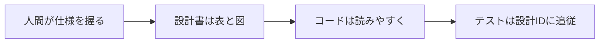
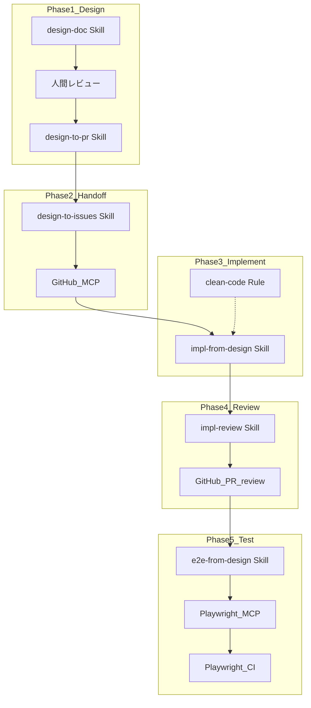
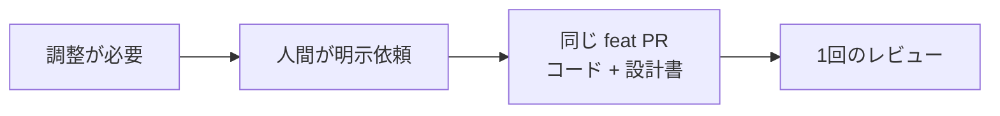

# 設計・開発・テスト 統合ワークフロー

人間が仕様を把握し続けながら、設計書を根拠に AI 実装・レビュー・Playwright テストへつなぐ一連の手順。

## 思想



| 層 | 原則 |
|----|------|
| 設計書 | 人間向け。表・図のみ。AI は読み取り専用 |
| 実装コード | **読みやすさ最優先**。小さな関数・明確な命名・既存規約に従う |
| テスト | `tests.md` の TST-ID と 1:1。フロントは Playwright |
| 自動化 | MCP で GitHub / ブラウザ操作。Skill で手順を固定 |

**きれいなコード（`rules/clean-code.mdc`）:**
- 1 ファイル 1 責務、関数は短く、名前は意図が伝わる
- マジックナンバー・深いネストを避ける
- 設計 ID（REQ/API/SCR/CMP/TST）をコメント・テスト名に残す
- 過剰な抽象化・不要なヘルパーを作らない

## 技術スタック

| 層 | 技術 |
|----|------|
| Frontend | React + TypeScript |
| Backend | Java Spring Boot（Controller / Service / Repository） |
| フロントテスト | **Playwright**（E2E + コンポーネント） |
| バックエンドテスト | JUnit + Mockito + MockMvc |
| 設計書 | Markdown + `index.html`（Git 管理） |
| 自動化 | Cursor Plugin + GitHub MCP + Playwright MCP + Cloud Agent |

プラグイン構成: [docs/plugin.md](plugin.md)

---

## ワークフロー自動ルーティング（workflow-router）

会話の開始時や「次何する？」「続き」などの依頼時に、**いまどの Phase にいるか**を推定し、まだ使っていない Skill を短く提案します。

| 検出シグナル | 例 |
|--------------|-----|
| ブランチ | `design/*` → 設計、`feat/*` → 実装 |
| `manifest.yaml` | `status: draft` → 設計中、`approved` → Handoff/実装 |
| 未コミット変更 | `docs/design/` → 設計更新、コード → 実装中 |
| Open PR / Issue | GitHub MCP または `gh`（任意） |
| Playwright spec 数 | 実装完了後 → `e2e-from-design` |

**コンポーネント:**

| 種別 | パス | 役割 |
|------|------|------|
| Rule | `rules/workflow-router.mdc` | 常時適用。フェーズ検出と Skill 提案 |
| Skill | `skills/workflow-router/SKILL.md` | Phase → Skill マップ・提案フォーマット |
| Script | `skills/workflow-router/scripts/detect-state.sh` | git / manifest / 変更状態から推定 |
| Command | `/workflow-status` | 状態確認を明示実行 |

**提案例（応答末尾に 1 行）:**

```markdown
---
**ワークフロー提案**（推定: 実装フェーズ）
→ `impl-from-design スキルで Issue #123 を実装して`
```

**提案しない場合:** すでに正しい Skill を使用中、ユーザーが別経路を明示、同じ提案を拒否済み。

---

## 統合フロー（5 Phase）



---

## Phase 1: 設計

### 1-1. 要件整理（会話）

- 何を作るか / 何を作らないか
- 既存機能との依存関係
- 機能 ID（kebab-case、例: `user-auth`）を決める

### 1-2. 設計書作成（`design-doc` Skill）

```
design-doc スキルを使って <feature-id> の設計書を作って
```

**出力先:** `docs/design/<project>/features/<feature-id>/`

| 順序 | ファイル | 内容 |
|------|----------|------|
| 1 | `README.md` | 機能サマリ・スコープ・受け入れ条件 |
| 2 | `functional.md` | ユースケース・ビジネスルール・要件（REQ-ID） |
| 3 | `api.md` | API 一覧表・エラー表 |
| 4 | `layers.md` | Controller / Service / Repository 責務表 |
| 5 | `db.md` | ER 図・テーブル定義 |
| 6 | `screens.md` | 画面カード・遷移図・対応マトリクス |
| 7 | `components.md` | コンポーネントツリー（**screens 確定後**） |
| 8 | `flows.md` | シーケンス図・状態遷移 |
| 9 | `tests.md` | Playwright シナリオ・トレーサビリティ表 |

#### 画面設計（screens.md）

```
1. ユースケース → 必要画面の洗い出し
2. 画面カード（目的・レイアウト表・ASCII ワイヤー・状態表）
3. 画面遷移図（Mermaid）
4. 対応マトリクス（SCR ↔ REQ / API / CMP）
5. components.md を書く
```

#### ID 体系

| プレフィックス | 例 | 用途 |
|----------------|-----|------|
| REQ- | REQ-AUTH-001 | 要件 |
| API- | API-AUTH-001 | API |
| SCR- | SCR-AUTH-001 | 画面 |
| CMP- | CMP-AUTH-001 | UI コンポーネント |
| TST- | TST-AUTH-001 | テスト |
| UC- | UC-AUTH-001 | ユースケース |
| BR- | BR-AUTH-001 | ビジネスルール |

### 1-3. 人間レビュー

`docs/design/<project>/index.html` をブラウザで確認。

**設計書チェックリスト:**
- [ ] 表・図だけで全体像が把握できる
- [ ] REQ-ID がユースケース・受け入れ条件と対応
- [ ] API・画面・DB・層設計の整合性
- [ ] 画面カードに目的・レイアウト・状態が定義されている
- [ ] `tests.md` に Playwright シナリオ（E2E / コンポーネント）が定義されている
- [ ] コードレベルの記述が含まれていない

### 1-4. 設計 PR（`design-to-pr` Skill）

```
design-to-pr スキルで <feature-id> の設計PRを作って
```

| 項目 | 内容 |
|------|------|
| ブランチ | `design/<feature-id>` |
| ラベル | `design` |
| 作成 | GitHub MCP 優先、不可なら `gh pr create` |
| マージ後 | `manifest.yaml` の `status` を `approved` に更新 |

---

## Phase 2: 開発準備（GitHub MCP）

### 2-1. 実装 Issue 作成（`design-to-issues` Skill）

```
design-to-issues スキルを使って <feature-id> の実装Issueを作って
```

| Issue 種別 | 内容 |
|------------|------|
| **Epic Issue** | 機能概要・設計書リンク・要件一覧 |
| **Sub-Issue** | REQ-ID ごとに 1 つ |

**GitHub 連携:** GitHub 公式 MCP 優先 → 不可なら `gh issue create` フォールバック。

Sub-Issue 本文に必ず含める:
- 設計書参照パス（読み取り専用）
- 関連 API / 画面 / コンポーネント / テスト ID
- Epic へのリンク

### 2-2. 実装の進め方

| 規模 | 進め方 |
|------|--------|
| 小（1〜2 REQ） | Sub-Issue 1 つで Agent 1 回 |
| 中〜大 | REQ ごとに Sub-Issue → Agent を分離 |
| 複数人 | Sub-Issue に `backend` / `frontend` ラベル |

---

## Phase 3: 実装（きれいなコード）

### 3-1. 実装（`impl-from-design` Skill）

```
impl-from-design スキルを使って Issue #123 を実装して
```

**適用ルール:**
- `rules/design-readonly.mdc` — 通常は読み取り専用。**軽微な調整**は人間依頼時に同一 feat PR 内で可
- `rules/clean-code.mdc` — 読みやすいコード

**層順序（Java）:** Entity → Repository → Service → Controller → DTO

**層順序（React）:** コンポーネント → 画面 → API 連携 → ルーティング

### 3-2. 実装 PR

| 項目 | 内容 |
|------|------|
| ブランチ | `feat/<feature-id>` or `feat/<feature-id>-<req-id>` |
| リンク | `Closes #<sub-issue-number>` |
| 本文 | REQ-ID・触った層。軽微な調整があれば **仕様調整（軽微）** セクション |
| 作成 | GitHub MCP 優先、不可なら `gh pr create` |

---

## Phase 4: レビュー

### 4-1. コードレビュー（`impl-review` Skill）

```
impl-review スキルで PR #456 をレビューして
```

| 観点 | 確認内容 |
|------|----------|
| 設計整合 | REQ/API/SCR と実装の対応 |
| 読みやすさ | 命名・関数長・ネスト深度 |
| 層責務 | MVC 違反がないか |
| テスト準備 | TST-ID 用 Playwright spec の有無 |
| 設計書 | `docs/design/` を変更していないか |

**運用:**
- AI レビューは提案コメントのみ（自動マージしない）
- 人間レビュー必須
- `cursor-subscriptions` の `subscribe_github_pr` でレビュー待ち可能

---

## Phase 5: テスト（Playwright）

### 5-1. テスト戦略

| 種別 | 対象 | ツール | 設計参照 |
|------|------|--------|----------|
| E2E | 画面フロー | Playwright | `screens.md` + `flows.md` |
| コンポーネント | UI | Playwright CT | `components.md` |
| 単体 | Service | JUnit + Mockito | `functional.md` |
| 結合 | Controller | MockMvc | `api.md` |
| 単体 | Repository | @DataJpaTest | `db.md` |

**フロントエンドのテストはすべて Playwright**（Vitest / RTL は使わない）。

### 5-2. テスト生成・実行（`e2e-from-design` Skill）

```
e2e-from-design スキルを使って user-auth の Playwright テストを作って
```

1. `tests.md` の TST-ID 一覧を読む
2. `tests/e2e/TST-xxx.spec.ts` / `tests/components/CMP-xxx.spec.ts` を生成
3. Playwright MCP でローカル実行・デバッグ
4. 失敗時は Issue にコメント（設計書は変更しない）

**テストファイル命名:** テスト名・ファイル名に TST-ID / CMP-ID を含める。

### 5-3. CI

GitHub Actions で `npx playwright test` を実装 PR で実行。Agent は `subscribe_github_ci` で結果待ち。

---

## MCP セットアップ

Cursor に **GitHub MCP** と **Playwright MCP** を導入済みなら、そのまま各 Skill から利用可能。`GetDynamicTools` でツールを確認してから `CallDynamicTool` で呼び出す。

| MCP | 用途 | 使う Skill |
|-----|------|------------|
| **GitHub** | Issue / PR 作成・コメント | design-to-pr, design-to-issues, impl-from-design |
| **Playwright** | ブラウザ操作・E2E デバッグ | e2e-from-design |
| **cursor-subscriptions** | CI / PR レビュー待ち | subscribe skill 経由 |

**連携 Skills（Cursor 既存）:**
- **context7-mcp** — 実装中の React / Spring Boot / Playwright API 参照
- **subscribe** — push 後の CI/レビュー待ち（ポーリング不要）
- Notion skills — GitHub の代替トラック（任意）

Integration map: [`skills/_shared/workflow-integrations.md`](../skills/_shared/workflow-integrations.md)

---

## 仕様調整・変更時

### 軽微な調整（別 PR 不要）

実装 PR（`feat/`）内でコードと設計書を一緒に更新する。



**条件:**
- 人間が明示的に依頼
- REQ-ID 不変（文言・閾値・ラベル・状態表の明確化など）
- PR 本文に **仕様調整（軽微）** セクションを記載

**例:** エラーメッセージ統一、バリデーション閾値、画面ラベル

### 設計 PR マージ前

未マージの `design/<feature-id>` ブランチに追コミットするだけ。別 PR 不要。

### 大きな仕様変更（別 design PR）

- 新 REQ-ID 追加
- API path / method 変更
- 画面フロー変更

AI は勝手に設計書を更新しない。人間の依頼がなければ Issue にコメントで報告のみ。

---

## Skill 一覧

| Skill | Phase | コマンド例 |
|-------|-------|------------|
| `workflow-router` | 横断 | `今どのフェーズ？` / `/workflow-status` |
| `design-doc` | 1 | `design-doc スキルで user-auth の設計書を作って` |
| `design-to-pr` | 1 | `design-to-pr スキルで user-auth の設計PRを作って` |
| `design-to-issues` | 2 | `design-to-issues スキルで user-auth の実装Issueを作って` |
| `impl-from-design` | 3 | `impl-from-design スキルで Issue #123 を実装して` |
| `impl-review` | 4 | `impl-review スキルで PR #456 をレビューして` |
| `e2e-from-design` | 5 | `e2e-from-design スキルで user-auth のテストを作って` |

## 連携 Skills（Cursor 既存環境）

| Skill / MCP | Phase | 役割 |
|-------------|-------|------|
| **subscribe** + cursor-subscriptions | 3–5 | PR/CI 完了待ち（ポーリング不要） |
| **context7-mcp** | 3 | React / Spring Boot / Playwright API 参照 |
| spec-to-implementation | 2 | Notion 版 Issue（GitHub 未使用時） |
| tasks-build | 3 | Notion 版実装（GitHub Issue 未使用時） |

詳細: [`skills/_shared/workflow-integrations.md`](../skills/_shared/workflow-integrations.md)

## クイックリファレンス

```
1. 会話 → design-doc → 人間レビュー（index.html）
2. design-to-pr → 設計PRマージ
3. design-to-issues → Epic + Sub-Issues（GitHub MCP）
4. impl-from-design → 実装PR（clean-code Rule）
5. impl-review → 人間 + AI レビュー
6. e2e-from-design → Playwright テスト生成・実行・CI
7. Epic 受け入れ完了
```

## 関連ドキュメント

- [README](../README.md) — Plugin 概要
- [Plugin 開発ガイド](plugin.md) — MCP 設定・公開手順
- [サンプル設計書](../examples/my-app/features/user-auth/)
- `skills/` — 各 Skill 詳細
- [`skills/_shared/workflow-integrations.md`](../skills/_shared/workflow-integrations.md) — 既存 Skills / MCP 連携
