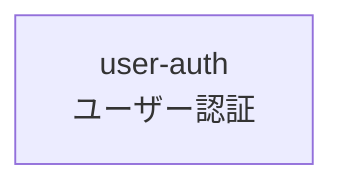

# 機能マップ

## 機能一覧

| 機能ID | 名前 | ステータス | 概要 |
|--------|------|------------|------|
| user-auth | ユーザー認証 | draft | メール・パスワードによるログイン |

## 機能間の関係

## 実装順序（案）

| 順序 | 機能ID | 理由 |
|------|--------|------|
| 1 | user-auth | 他機能の前提となる認証 |
