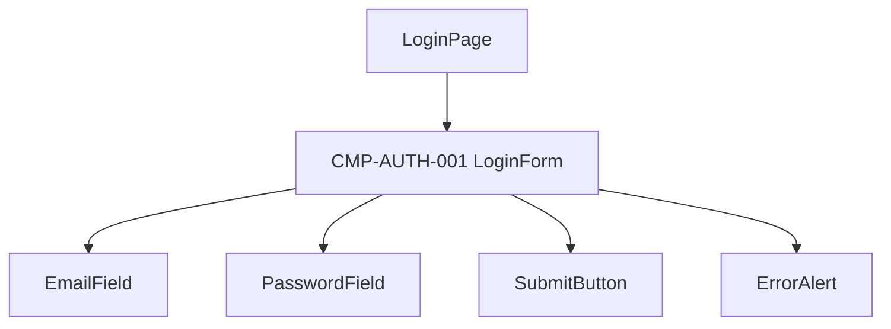

# UIコンポーネント: ユーザー認証

> `screens.md` の画面カード確定後に分解する。SCR-AUTH-001 → CMP-AUTH-001。

## コンポーネントツリー

## コンポーネント一覧

| CMP-ID | 名前 | 役割 | 親 | 主な入出力 |
|--------|------|------|-----|------------|
| CMP-AUTH-001 | LoginForm | ログイン入力フォーム全体 | LoginPage | 入力値を送信、成功/失敗を親に通知 |
| — | EmailField | メール入力 | LoginForm | 入力値をフォームに渡す |
| — | PasswordField | パスワード入力 | LoginForm | 入力値をフォームに渡す |
| — | SubmitButton | 送信トリガー | LoginForm | クリックで送信 |
| — | ErrorAlert | エラー表示 | LoginForm | エラーメッセージを表示 |

## CMP-AUTH-001 補足

- バリデーション: BR-AUTH-001, BR-AUTH-002 に従う
- 送信中はボタンを無効化（二重送信防止）
- 認証成功時は親の `onSuccess` を呼び出す
