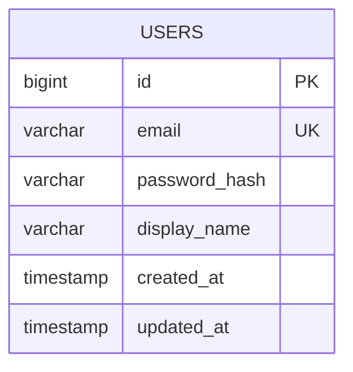

# データ設計: ユーザー認証

## ER図

## テーブル: TBL-USERS (users)

| カラム | 型 | 必須 | 説明 |
|--------|-----|------|------|
| id | BIGINT | ○ | 主キー |
| email | VARCHAR(255) | ○ | ログインID（ユニーク） |
| password_hash | VARCHAR(255) | ○ | ハッシュ化パスワード |
| display_name | VARCHAR(100) | ○ | 表示名 |
| created_at | TIMESTAMP | ○ | 作成日時 |
| updated_at | TIMESTAMP | ○ | 更新日時 |

## インデックス

| 名前 | カラム | 用途 |
|------|--------|------|
| uk_users_email | email | ログイン検索 |

## 関連

| テーブル | 関連API | 関連層 |
|----------|---------|--------|
| users | API-AUTH-001 | UserRepository |
