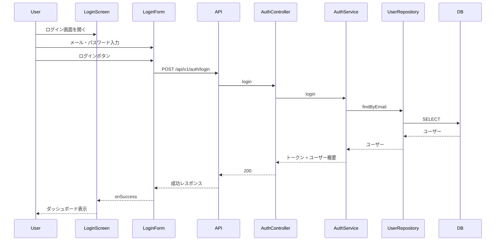
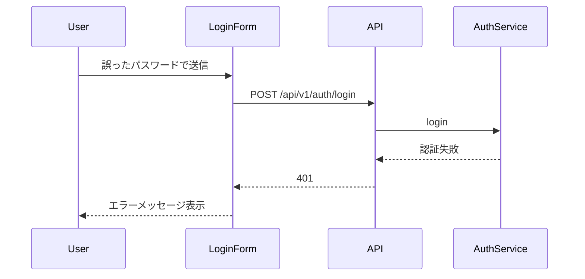

# フロー: ユーザー認証

## シーケンス: ログイン（正常系）

## シーケンス: ログイン（異常系）

## 状態遷移（ログインフォーム）

| 状態 | イベント | 次の状態 |
|------|----------|----------|
| idle | 送信 | submitting |
| submitting | 成功 | success（画面遷移） |
| submitting | 失敗 | error |
| error | 再入力 | idle |
