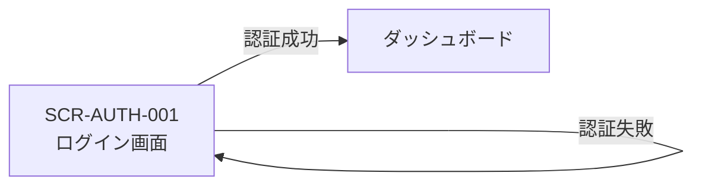

# 画面設計: ユーザー認証

## ユースケースと画面の対応

| UC-ID | 必要な画面 |
|-------|------------|
| UC-AUTH-001 | SCR-AUTH-001（ログイン成功 → ダッシュボードへ） |
| UC-AUTH-002 | SCR-AUTH-001（エラー表示） |

## 画面一覧

| SCR-ID | 名前 | ルート | 主な操作 | 呼ぶAPI |
|--------|------|--------|----------|---------|
| SCR-AUTH-001 | ログイン画面 | /login | ログインボタン押下 | API-AUTH-001 |

## 画面遷移



## 対応マトリクス

| SCR-ID | 画面 | 関連REQ | 呼ぶAPI | 主コンポーネント | 遷移先 |
|--------|------|---------|---------|------------------|--------|
| SCR-AUTH-001 | ログイン画面 | REQ-AUTH-001, REQ-AUTH-002 | API-AUTH-001 | CMP-AUTH-001 | ダッシュボード（成功時） |

---

## SCR-AUTH-001: ログイン画面

### 目的

未認証ユーザーを認証し、アプリ内（ダッシュボード）へ遷移させる。

### レイアウト

| エリア | 要素 | 動作 |
|--------|------|------|
| ヘッダー | アプリ名（ロゴ） | 表示のみ |
| 中央 | メールアドレス入力 | テキスト入力 |
| 中央 | パスワード入力 | マスク入力 |
| 下部 | ログインボタン | フォーム送信 |
| フォーム上部 | エラーアラート | 認証失敗時に表示 |

### ワイヤー（ASCII）

```
┌─────────────────────────┐
│        My App           │
├─────────────────────────┤
│  [ エラーメッセージ ]   │  ← エラー時のみ
│                         │
│  メールアドレス         │
│  [___________________]  │
│                         │
│  パスワード             │
│  [___________________]  │
│                         │
│     [  ログイン  ]      │
└─────────────────────────┘
```

### 状態

| 状態 | 見た目・振る舞い |
|------|------------------|
| 初期 | 入力欄空、ボタン有効 |
| バリデーションエラー | 該当入力欄下にエラー文字 |
| 送信中 | ボタン無効、スピナー表示 |
| 認証エラー | フォーム上部に「メールまたはパスワードが違います」 |
| 成功 | ダッシュボードへ遷移 |

### 操作と結果

| 操作 | 条件 | 結果 |
|------|------|------|
| ログインボタン | 入力が有効 | API-AUTH-001 呼び出し |
| ログインボタン | バリデーションNG | API呼び出しなし、欄下にエラー |
| API成功 | — | ダッシュボードへ遷移 |
| API失敗 | 401 | エラーメッセージ表示、画面に留まる |
